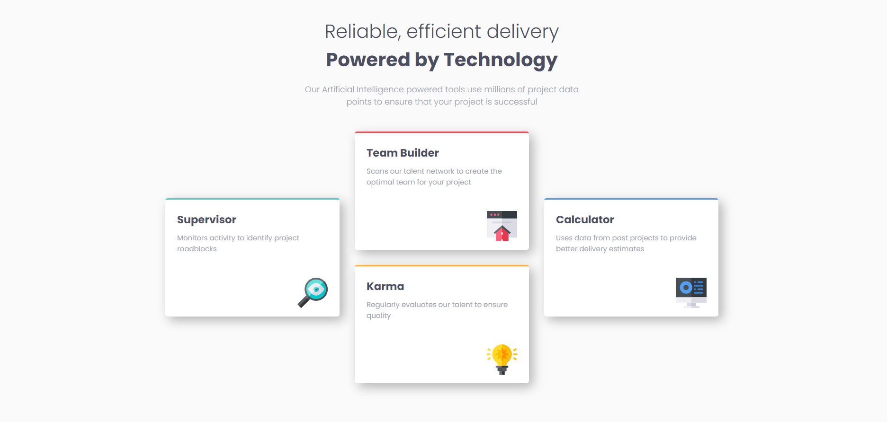
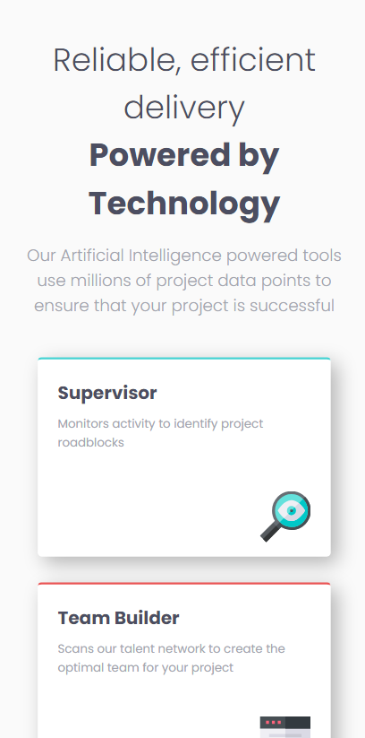

# Frontend Mentor - Four card feature section solution

This is a solution to the [Four card feature section challenge on Frontend Mentor](https://www.frontendmentor.io/challenges/four-card-feature-section-weK1eFYK). Frontend Mentor challenges help you improve your coding skills by building realistic projects. 

## Table of contents

- [Overview](#overview)
  - [The challenge](#the-challenge)
  - [Screenshot](#screenshot)
  - [Links](#links)
- [My process](#my-process)
  - [Built with](#built-with)
  - [What I learned](#what-i-learned)
  - [Continued development](#continued-development)
  - [Useful resources](#useful-resources)
- [Author](#author)

## Overview

### The challenge

Users should be able to:

- View the optimal layout for the site depending on their device's screen size

### Screenshot

### Links

- Solution URL: [Add solution URL here](https://github.com/ToprakPehleeone/four-card-feature-section-master)
- Live Site URL: [Add live site URL here](https://toprakpehleeone.github.io/four-card-feature-section-master/)

## My process

### Built with

- Semantic HTML5 markup
- CSS custom properties
- Flexbox
- CSS Grid

### What I learned

How to use basic grid properities. 

### Continued development

I need to get more comfortable using grid for responsive designs.

### Useful resources

- [Example resource 1](https://www.w3schools.com/css/css_rwd_grid.asp) - This helped me for using grid. I really liked this pattern and will use it going forward.

## Author

- Website - [Toprak Pehlivan](https://github.com/ToprakPehleeone)
- Frontend Mentor - [@ToprakPehleeone](https://www.frontendmentor.io/profile/ToprakPehleeone)
- Twitter - [@ToprakPehlivan](https://x.com/ToprakPehlivan)

